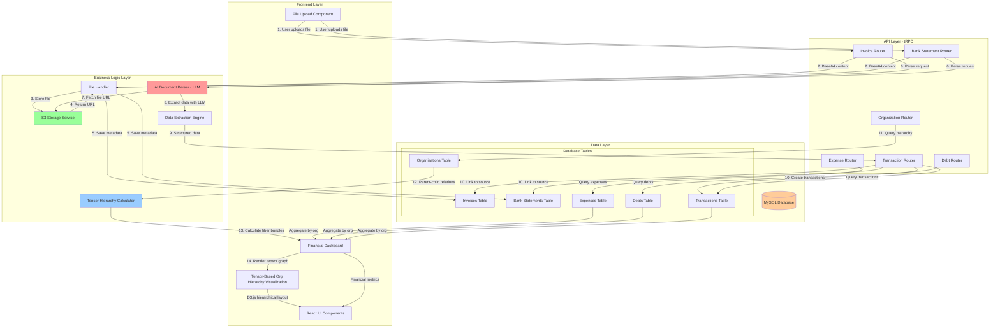
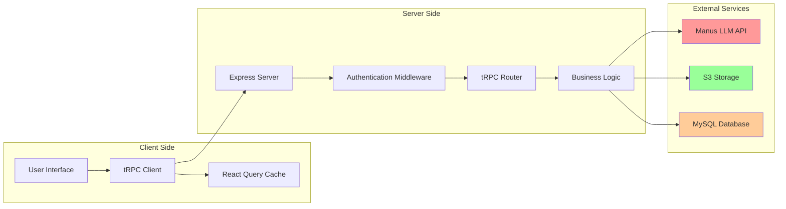
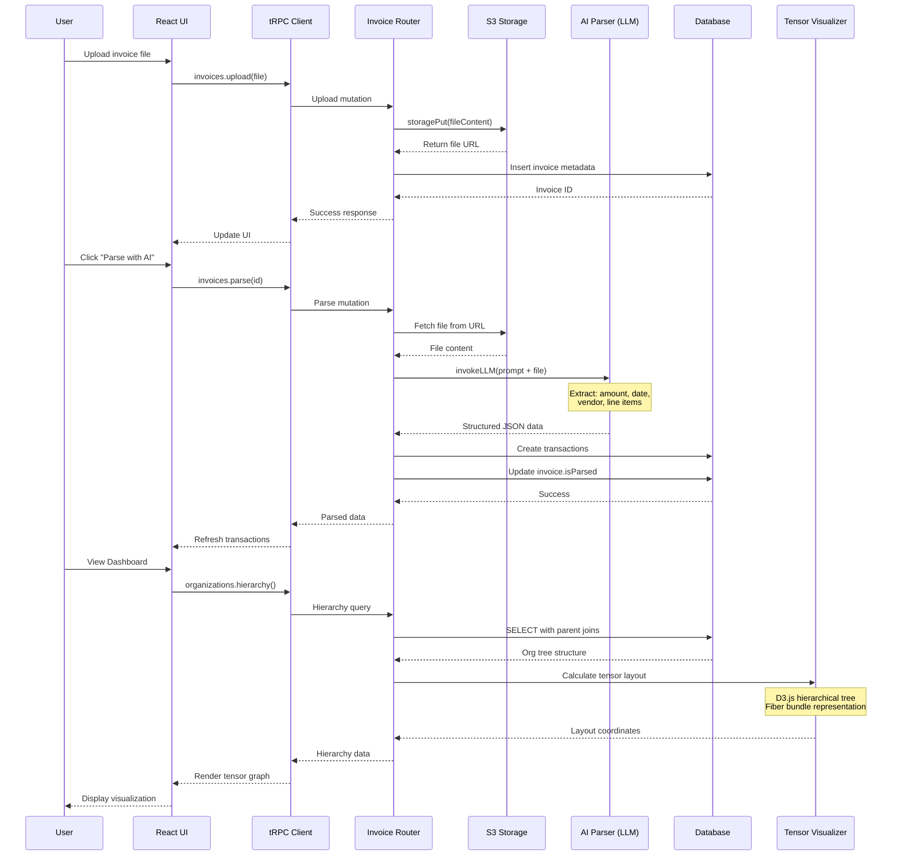
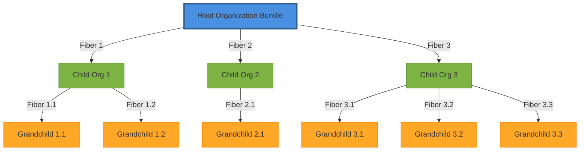
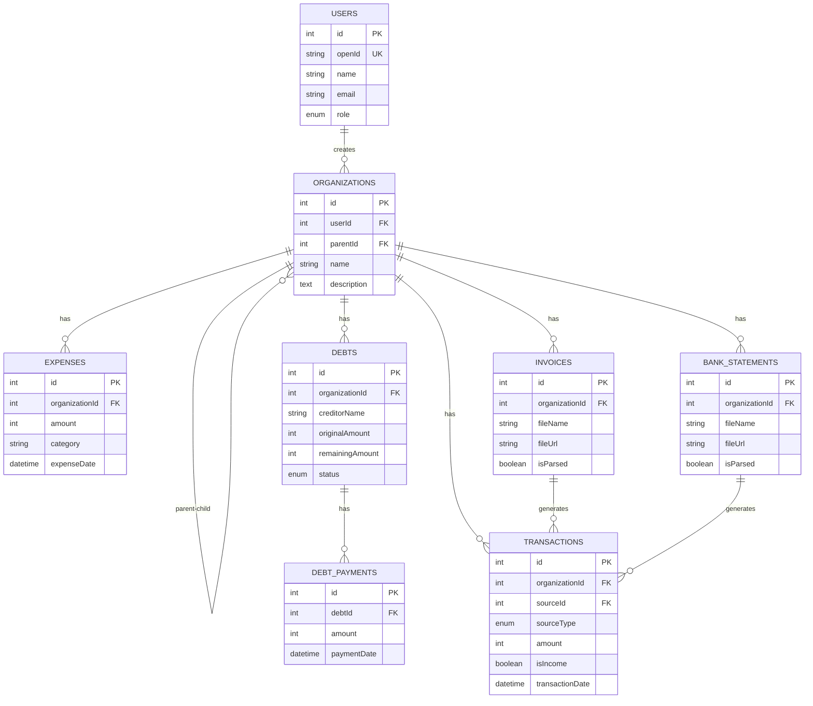
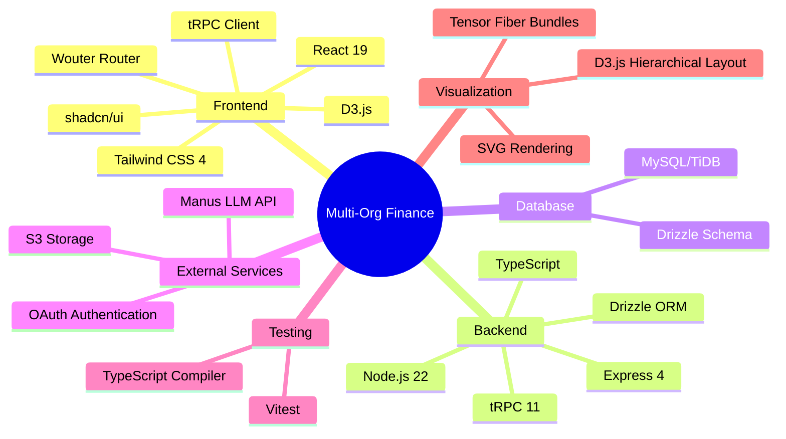
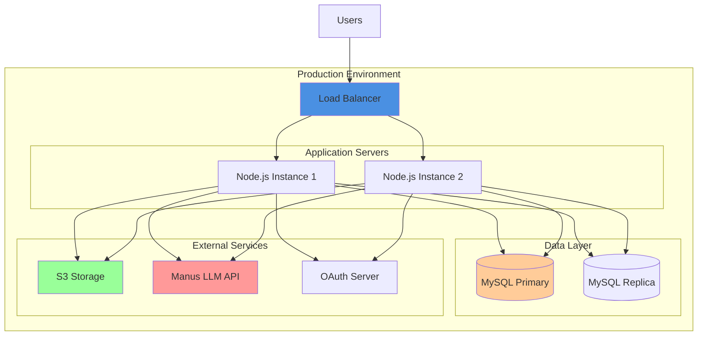

# Multi-Org Finance Management System Architecture

## High-Level Data Flow: Upload → AI Parsing → Tensor Visualization

## Detailed Component Architecture

## Data Flow Sequence: Invoice Upload to Visualization

## Tensor-Based Hierarchy Representation

## Database Schema Relationships

## Technology Stack

## Key Architectural Patterns

### 1. **Tensor-Based Hierarchy**
- Organizations are modeled as fiber bundles
- Parent organizations are bundles containing child fibers
- D3.js hierarchical tree layout with custom fiber rendering
- Each connection represents a parent-child relationship as a fiber in the bundle

### 2. **AI-Powered Document Parsing**
- Files uploaded to S3 for persistent storage
- LLM (Claude) extracts structured data from unstructured documents
- Automatic transaction creation from parsed invoices/statements
- Metadata stored in database with links to S3 files

### 3. **Type-Safe API with tRPC**
- End-to-end type safety from database to UI
- No manual API contracts or REST endpoints
- Automatic serialization with SuperJSON (Date objects preserved)
- React Query integration for caching and optimistic updates

### 4. **Financial Aggregation**
- Real-time calculation of totals across org hierarchy
- Monthly and weekly financial views
- Debt tracking with payment history
- Transaction categorization and filtering

### 5. **Multi-Tenancy**
- User-scoped data isolation
- Organization hierarchy supports unlimited nesting
- Role-based access control (admin/user)
- OAuth-based authentication

## Deployment Architecture

---

## Summary

This architecture demonstrates:

1. **Separation of Concerns**: Clear boundaries between UI, API, business logic, and data layers
2. **Scalability**: Stateless API servers, database replication, external storage
3. **Type Safety**: End-to-end TypeScript with tRPC
4. **AI Integration**: LLM-powered document parsing for automation
5. **Advanced Visualization**: Tensor-based hierarchical representation using D3.js
6. **Real-time Updates**: React Query for optimistic UI updates
7. **Security**: OAuth authentication, user-scoped data, role-based access

The system efficiently handles the complete flow from document upload through AI parsing to visual representation in the tensor-based organization hierarchy.
